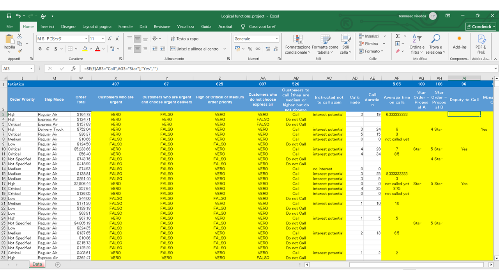

# Excel-Conditional_logic_Project
Applying logical functions in the worksheet

# To-Do List
- Populate column X so that it shows TRUE if they classify their order as High or Critical or if they have chosen Express Air as the mode of shipment. At the top of the column, count the number of cases for column X.  
- Populate column Y so that it shows TRUE if they classify their order as High or Critical AND they have chosen Express Air as the mode of shipment. At the top of the column, count the number of cases for column Y. 
- Populate column Z so that it shows TRUE if they classify their order as Medium or High or Critical. At the top of the column, count the number of cases for column Z. 
- Populate column AA so that it shows TRUE if they do not choose Express Air as the mode of shipment. Hint: The function NOT(condition) gives the opposite result, which may be useful here. At the top of the column, count the number of cases for column AA.
- Populate column AF so that it shows, if they were a client to be called, the average duration of the calls made to them. If an error results from this calculation because there have been no calls yet made, report "not called yet". If they were not a customer to call, leave the cell blank.
- Populate column AG: Star Order Proposal A with the value "Star" if the Order Total is more than $1,000.
If the Average Call Time is more than 7 minutes, and the order is a "4 Star" or "5 Star" order (according to Proposal B), then we want the Sales Manager to call them. If the customer has not been called yet, the manager should not call them. Populate column AJ: Manager to Call with an appropriate IF statement.

## Preview

